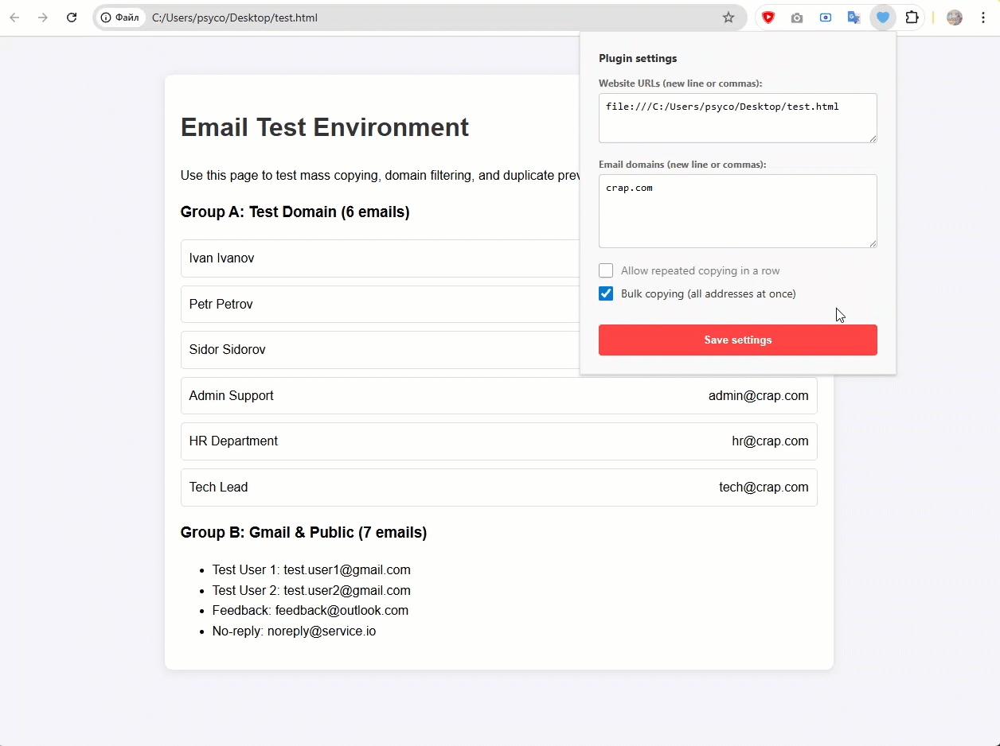

    
    

## Email Copy Tool

A lightweight browser extension for Google Chrome and Edge. It automates the extraction of email addresses from page content.

## Demo

### Features

* **Smart Scanning:** Automatically detects email addresses in real-time, including those inside dynamic popups and hover-over tooltips.

* **Domain Filtering:** Only copies emails matching your specified domains (e.g., @company.com).

* **Allow Repeated Copying:** By default, the plugin remembers the last copied value and won't copy it again to avoid clipboard spam.

* **Bulk Copying:** When enabled, the plugin scans the entire page and collects all unique email addresses matching your domain filter

* **Toast Notifications:** Displays a sleek, non-intrusive notification at the bottom of the screen upon successful copy.

* **Keep Screen Awake:** A single quick button in the popup prevents the browser and system from going idle while the extension is enabled.

## Installation (Developer Mode)

**Since this is a custom internal tool, install it manually:**

* Download or clone this repository to your local machine.

* Open your browser and navigate to:

    Edge: edge://extensions/

    Chrome: chrome://extensions/

* Enable "Developer mode" in the sidebar/top corner.

* Click "Load unpacked".

* Select the folder containing the extension files.

## Configuration

**After installation, click the extension's icon in your browser toolbar:**

**Target URL:** Enter the base URLs, separated by commas or new lines   (e.g., creatio.example.com).

**Domains:** Enter allowed email domains, separated by commas or new lines (e.g., @shwarma.com).

Click **"Save Settings"**.

If you need to keep the computer awake, open the popup and press **Enable keep awake**. Press the same button again to turn it off.

Refresh your page (F5) to apply changes.

# License

Distributed under the MIT License. Feel free to use and modify for your needs.